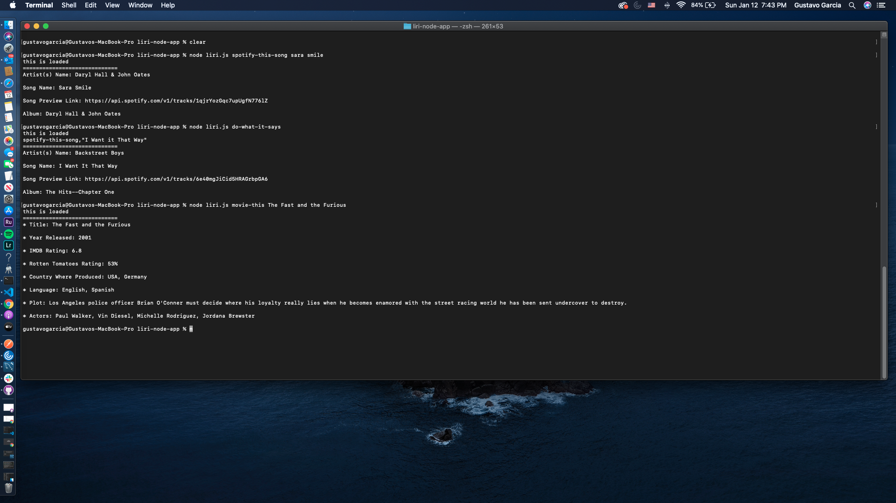

# liri-node-app

LIRI searches Bands in Town for concerts, Spotify for songs, and OMDB for movies.

node liri.js concert-this '<artist/band name here>'

Searches the Bands in Town Artist Events API for an artist and renders the following information about each event to the terminal:

Name of the venue

Venue location

Date of the Event (using the format "MM/DD/YYYY")

node liri.js spotify-this-song '<song name here>'

Displays the following information about the selected song in your terminal/bash window

Artist(s)

The song's name

A preview link of the song from Spotify

The album containing the song

If no song is provided, the program defaults to "The Sign" by Ace of Base.

node liri.js movie-this '<movie name here>'

This will output the following movie information to your terminal/bash window:

  * Title
  * Year movie was released
  * IMDB Rating
  * Rotten Tomatoes Rating
  * Country where movie was produced
  * Language(s)
  * Plot of the movie
  * Actors in the movie
If the user does not enter a movie selection, the program outputs data for the movie 'Mr. Nobody.'

node liri.js do-what-it-says

Runs spotify-this-song for "I Want it That Way".

